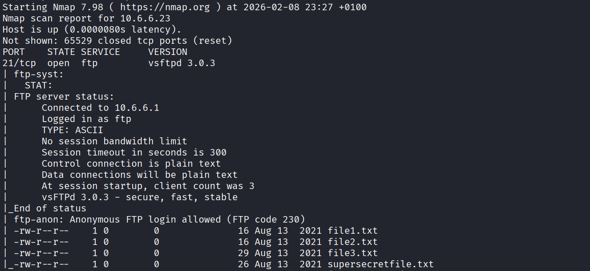
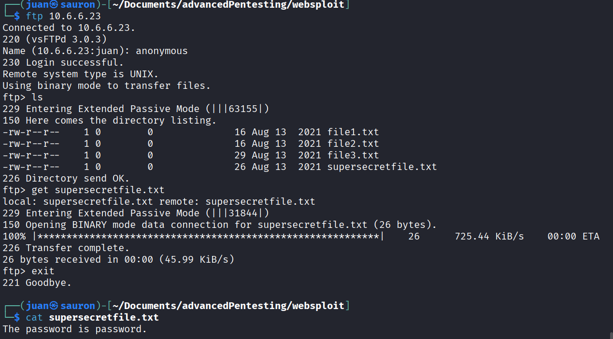

**CVE-ID**: EDU-GRAVEMIND-2026-T03-002  
**Title**: Anonymous FTP Access  
**Affected Lab**: gravemind  
**Component**: vsftpd 3.0.3 (FTP service on port 21)  
**Severity**: High  
**CVSS Vector**: AV:N/AC:L/PR:N/UI:N/S:U/C:H/I:N/A:N  
**CVSS Score**: 7.5  

**Description**:  
The vsftpd service on gravemind permits anonymous FTP login with unrestricted read access to sensitive files. The file `supersecretfile.txt` contains a hard-coded plaintext password ("password") that may be reused for SSH, SMB, or web application authentication on this host, enabling privilege escalation and lateral movement.

**Proof of Concept**:  

Payload 1: `nmap -sV -sC -T5 -p- [gravemindIP]`  
Effect: scans IP and test vulnerability scripts, detect versions on all open ports with insane speed

Payload 2: `ftp [gravemindIP]`  
Effect: Accesses an exposed file  

**Steps to Reproduce**:  
1. Determine gravemind IP by using commands `sudo docker ps` followed by `sudo docker inspect [CONTAINERID]`. Or any other method of choice.
2. Perform nmap scan on the found IP by also enabling the default scripts: `nmap -sV -sC -T5 -p- [gravemindIP]`. Output will mention that `Anonymous FTP login allowed (FTP code 230)`
3. Login with the `ftp [gravemindIP]`  command and use `anonymous` as your password.
4. List files with `ls` command. 
5. Download a file to your device with `get [fileName]`   
6. View the dowloaded file with `cat [fileName]`. You have successfully exploited the vulnerability

**Remediation**:  
1. Disable anonymous FTP access by setting  
2. Eliminate hardcoded credentials from filesystems

**Discovered By**: Team 3  
**Date**: 2026-02-09
