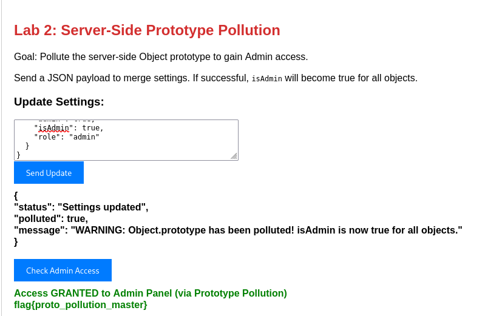

**CVE-ID**: EDU-PROTOPOLLUTE-2026-T03-005  
**Title**: Server-Side Prototype Pollution in Settings Update Function  
**Affected Lab**: proto-pollute  
**Component**: /update endpoint (Settings Update Function)  
**Severity**: High  
**CVSS Vector**: AV:N/AC:L/PR:N/UI:N/S:U/C:H/I:H/A:N  
**CVSS Score**: 8.8  

**Description**:  
The settings update functionality is vulnerable to Server-Side Prototype Pollution. The application fails to sanitize user input when processing JSON payloads, allowing attackers to inject properties into the Object prototype. This vulnerability enables privilege escalation by setting admin-related properties on the prototype, which then applies to all objects in the application.

**Proof of Concept**:  



Payload:
```json
{
  "__proto__": {
    "admin": true,
    "isAdmin": true,
    "role": "admin"
  }
} 
```


**Steps to Reproduce**:  
1. Run sudo docker ps to list running containers and identify the container ID for the `proto-pollute` lab.
2. Run `sudo docker inspect [containerid]` to retrieve the container's network configuration and extract the IP address.
3. Perform network reconnaissance using `nmap -sV -sC -T5 -p- [container-ip]` to identify open ports and services.
4. Add the target IP to `/etc/hosts` file: 10.6.6.45 proto.local.
5. Access the application in a web browser at `http://proto.local:5004`.
6. Navigate to the "Server-Side Prototype Pollution" lab section.
7. Enter the JSON payload shown above in the "Update Settings" input field.
8. Click the "Send Update" button to submit the payload.
9. Click the "Check Admin Access" button to verify privilege escalation.
10. Observe successful admin panel access with the message: "Access GRANTED to Admin Panel (via Prototype Pollution)".

**Remediation**:  
1. Use a safe JSON parsing library that blocks prototype pollution (e.g., `safe-json-parse` or `secure-json-parse`).
2. Implement strict input validation to whitelist only allowed properties
3. Sanitize user input by removing dangerous keys such as `__proto__`, `constructor`, and `prototype` 

**Discovered By**: Team 3  
**Date**: 2026-02-13
